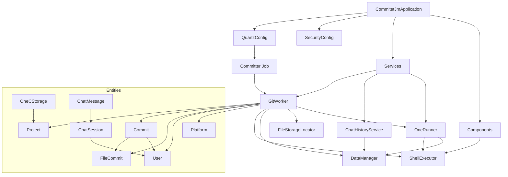

# Архитектура проекта Commitet JM

## Текущая архитектура

## Основные компоненты

### 1. Основное приложение
- `CommitetJmApplication` - главный класс Spring Boot приложения

### 2. Конфигурация
- `QuartzConfig` - настройка задач планировщика
- Security конфигурация

### 3. Сервисы
- `GitWorker` - основной сервис для работы с Git и файлами
- `ChatHistoryService` - сервис для работы с чатом
- `OneRunner` - сервис для работы с OneC

### 4. Компоненты
- `ShellExecutor` - компонент для выполнения shell команд

### 5. Scheduled Jobs
- `Committer` - задача для автоматического создания коммитов

### 6. Сущности (Entities)
- `Project` - проект
- `Commit` - коммит
- `FileCommit` - файл коммита
- `User` - пользователь
- `Platform` - платформа OneC
- `OneCStorage` - хранилище OneC
- `ChatSession` - сессия чата
- `ChatMessage` - сообщение чата