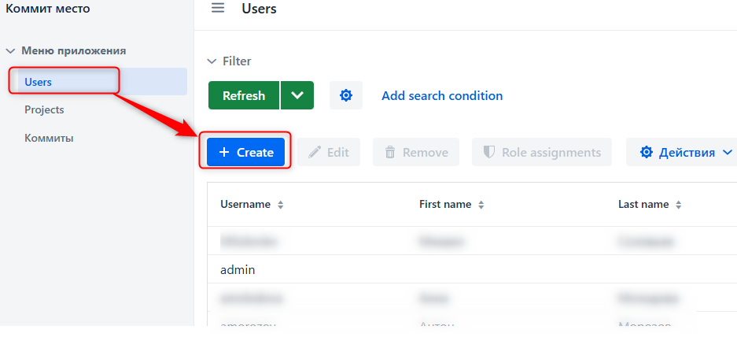
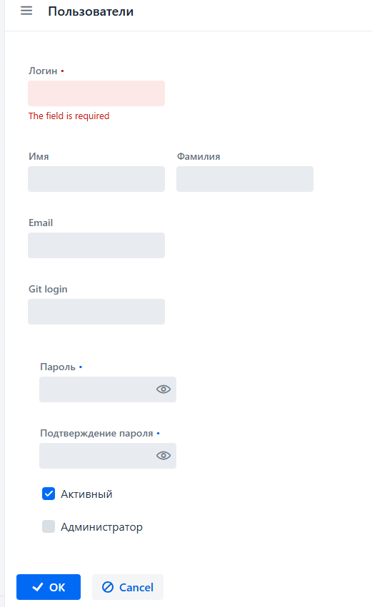
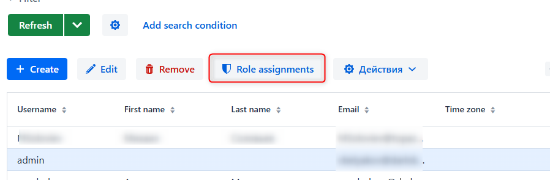
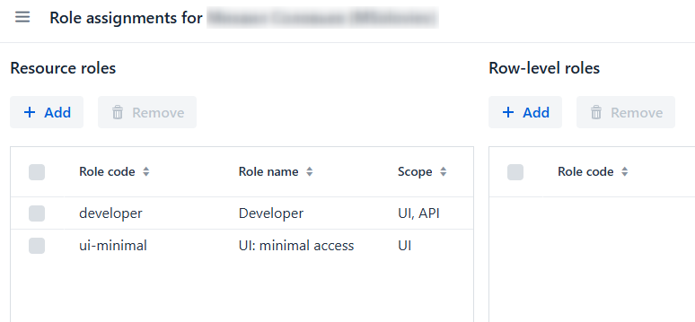
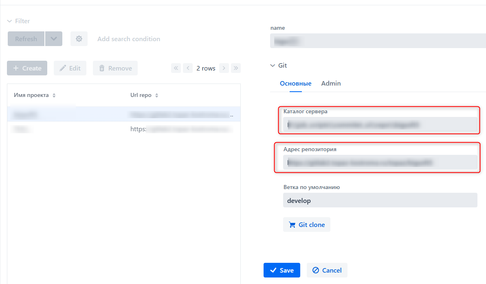

# О проекте

__Проект__ "ЛК разработчика"

__Цель__ упростить изменения по доработкам внешних отчетов обработок, текстов универсальных заданий, выполнения кода. Без локальных настроек на ПК 1C разработчика

# Разработка

Разработка ведется в IntelliJ IDEA Community Edition 2024.2.4 , при разработке используется версия Java 17, проект построен на базе фреймворка Jmix(https://jmix.ru), язык разработки Kotlin

# Развертывание

Для сборки нужно из корня проекта выполнить команду

```shell    
./gradlew "-Pvaadin.productionMode=true" bootJar
```

В каталоге **build\libs** будет создан файл вида commitet_jm-[номер версии вида x.y.z]-build.jar

Для запуска выполнить 
    
```cmd    
java -jar commitet_jm-[x.y.z]-build.jar  
```
Проект запустится на порту **8080**

Пользователь **admin** пароль **admin**


# Описание работы

## Интерфейс администратора

Администратору доступны разделы:
- Пользователи
- Список проектов
- Список коммитов 

### 1. Пользователи
1.1 Добавление пользователя
в меню выбираем "Users"



нажимаем "Создать"

Заполняем все поля, устанавливаем пароль. Если пользователь будет администрировать приложение - ставим флаг. Чтобы сохранить нажимем "ОК"


Выделяем пользователя в списке, станет активным команда **Role assigments** - позволяет назначать пользователям права доступа






Для обычного пользователя назначаем 2 роли:
- developer
- ui-minimal

1.2 Управление списком проектов

в меню выбираем "Projects"


При создании нужно прописать каталог хранения репозитория на сервере
Адрес репозитория. Без ".git"

Для клонирования в каталог нажать кнопку "Git clone"


## Интерфейс пользователя

Пользователю доступен список своих коммитов, управление своими настройками в Users, например для смены пароля.

При создании коммита  статус устанавливается в "New", когда начинается обработка коммита -Коммит открывается только для просмотра,  статус "Processed".
В случае успешной обработки статус "Success", при ошибке "Error", в детализации отобразится информация по ошибке.
 

# Прочее

мысли по доработкам фиксируются в issue