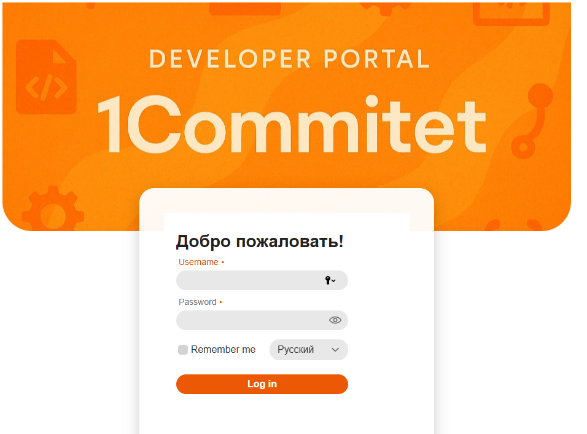
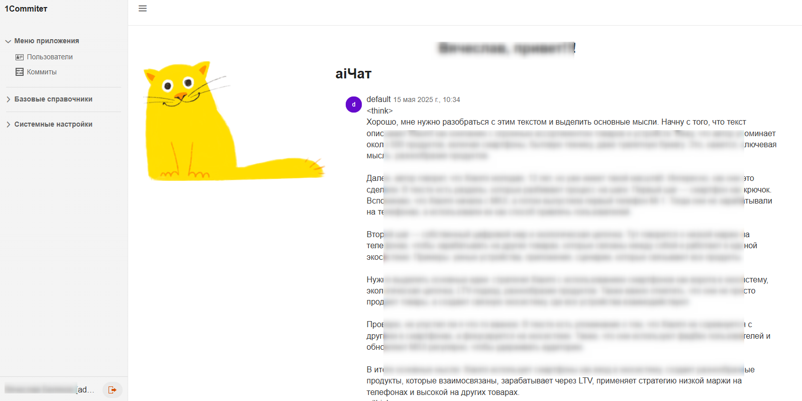
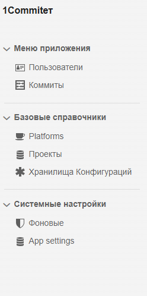
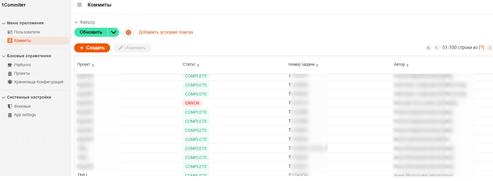

# О проекте

__Проект__ "1коммитет"

__Цель__ упростить изменения по доработкам внешних отчетов обработок, текстов универсальных заданий, выполнения кода. Без локальных настроек на ПК 1C разработчика

# Разработка

Разработка ведется в IntelliJ IDEA Community Edition 2024.2.4/Open IDE , при разработке используется версия Java 17, проект построен на базе фреймворка Jmix(https://jmix.ru), язык разработки Java

# Развертывание

Для сборки нужно из корня проекта выполнить команду

```shell    
./gradlew "-Pvaadin.productionMode=true" bootJar
```

В каталоге **build\libs** будет создан файл вида commitet_jm-[номер версии вида x.y.z]-build.jar

Для запуска выполнить 
```cmd    
java -jar commitet_jm-[x.y.z]-build.jar  
```
Проект запустится на порту **8080**

Пользователь **admin** пароль **admin**


# Описание работы
## Переопределение настроек
производится в файле application.yml  (должен быть в каталоге с .jar файлом)
Пример настроек 
```
app:
  version: 1.0.7

server:
  port: 8090

logging:
  level:
    root: INFO
    com.besl: INFO

spring:
  ai:
    ollama:
      chat:
        model: qwen3:14b
    ollama.base-url: http://localhost:11434
```

## Интерфейс администратора

Администратору доступны разделы:
- Пользователи
- Список проектов
- Список коммитов 

## Актуальный дизайн
#### Авторизация


#### Стартовая


#### Меню администратора

#### Список коммитов


  
### 1. Пользователи
1.1 Добавление пользователя
в меню выбираем "Users"


нажимаем "Создать"

Заполняем все поля, устанавливаем пароль. Если пользователь будет администрировать приложение - ставим флаг. Чтобы сохранить нажимем "ОК"


Выделяем пользователя в списке, станет активным команда **Role assigments** - позволяет назначать пользователям права доступа


Для обычного пользователя назначаем 2 роли:
- developer
- ui-minimal

1.2 Управление списком проектов

в меню выбираем "Projects"


При создании нужно прописать каталог хранения репозитория на сервере
Адрес репозитория. Без ".git"

Для клонирования в каталог нажать кнопку "Git clone"


## Интерфейс пользователя

Пользователю доступен список своих коммитов, управление своими настройками в Users, например для смены пароля.

При создании коммита  статус устанавливается в "New", когда начинается обработка коммита -Коммит открывается только для просмотра,  статус "Processed".
В случае успешной обработки статус "Success", при ошибке "Error", в детализации отобразится информация по ошибке.
 

# Прочее
__В разработке базовая админка для хранилищ конфигураций__

мысли по доработкам фиксируются в issue

---

# REST API

## Создание коммита

### Endpoint
```
POST /api/commits
Content-Type: application/json
```

### Параметры запроса

#### CommitCreateRequest

| Поле | Тип | Обязательное | Описание |
|------|-----|--------------|----------|
| `externalUserId` | String | Нет | Внешний ID пользователя (автора коммита). Если не указан, используется пользователь по умолчанию |
| `externalProjectId` | String | Нет | Внешний ID проекта. Если не указан, используется `projectId` |
| `projectId` | UUID | Нет | UUID проекта (используется, если не указан `externalProjectId`) |
| `userId` | UUID | Нет | UUID пользователя (устаревшее, используйте `externalUserId`) |
| `taskNum` | String | Да | Номер задачи. Используется для создания имени ветки |
| `description` | String | Да | Описание коммита |
| `fixCommit` | Boolean | Нет | Флаг, указывающий что это исправление (по умолчанию false) |
| `files` | Array\<FileData\> | Нет | Список файлов для коммита |

#### FileData

| Поле | Тип | Обязательное | Описание |
|------|-----|--------------|----------|
| `name` | String | Да | Имя файла |
| `data` | String | Да | Содержимое файла в формате Base64 |
| `type` | String | Да | Тип файла: REPORT, DATAPROCESSOR, SCHEDULEDJOBS, EXTERNAL_CODE, EXCHANGE_RULES |

### Пример запроса

```json
{
  "externalUserId": "user-from-1c-system",
  "externalProjectId": "project-external-123",
  "taskNum": "TASK-456",
  "description": "Добавлена обработка для выгрузки данных",
  "fixCommit": false,
  "files": [
    {
      "name": "ВыгрузкаДанных.epf",
      "data": "UEsDBBQAAAAIAKmF...",
      "type": "DATAPROCESSOR"
    }
  ]
}
```

### Ответ при успехе (201 Created)

```json
{
  "success": true,
  "commitId": "550e8400-e29b-41d4-a716-446655440000",
  "message": "Коммит создан успешно",
  "authorId": "660e8400-e29b-41d4-a716-446655440111",
  "authorUsername": "ivanov.i"
}
```

### Ответы при ошибках

#### 400 Bad Request - Ошибка валидации
```json
{
  "error": "VALIDATION_ERROR",
  "message": "Ошибка валидации данных",
  "details": {
    "errors": [
      "taskNum не может быть пустым",
      "description не может быть пустым"
    ]
  }
}
```

#### 404 Not Found - Проект не найден
```json
{
  "error": "CREATE_FAILED",
  "message": "Проект не найден"
}
```

#### 500 Internal Server Error
```json
{
  "error": "INTERNAL_ERROR",
  "message": "Внутренняя ошибка сервера",
  "details": {
    "exception": "NullPointerException: ..."
  }
}
```

## Получение статуса коммита

### Endpoint
```
GET /api/commits/{commitId}/status
```

### Параметры
- `commitId` - UUID коммита

### Пример запроса
```
GET /api/commits/550e8400-e29b-41d4-a716-446655440000/status
```

### Ответ при успехе (200 OK)
```json
{
  "commitId": "550e8400-e29b-41d4-a716-446655440000",
  "status": "COMPLETE",
  "hashCommit": "a1b2c3d4e5f6",
  "urlBranch": "https://github.com/org/repo/tree/feature/TASK-456",
  "errorInfo": null,
  "dateCreated": "2026-02-07T15:30:00"
}
```

### Статусы коммита
- `NEW` - Коммит создан, ожидает обработки
- `PROCESSED` - Коммит обрабатывается
- `COMPLETE` - Коммит успешно создан
- `ERROR` - Ошибка при создании коммита

## Управление внешними идентификаторами

Для интеграции с внешними системами пользователи и проекты могут иметь несколько внешних идентификаторов.

### Добавление внешнего ID пользователю
1. Войдите как администратор
2. Откройте карточку пользователя
3. В разделе "Внешние идентификаторы" нажмите "Добавить ID"
4. Укажите:
   - **Внешний ID** - идентификатор из внешней системы
   - **Источник** - название системы (например, "1C", "LDAP")
   - **Описание** - дополнительная информация

### Добавление внешнего ID проекту
Аналогично пользователю, через карточку проекта (только для администраторов).

## Примеры использования

### Создание коммита из 1C
```1c
Функция СоздатьКоммитВGit(НомерЗадачи, Описание, МассивФайлов)

    Запрос = Новый HTTPЗапрос("/api/commits");
    Запрос.Заголовки.Вставить("Content-Type", "application/json");

    Данные = Новый Структура;
    Данные.Вставить("externalUserId", ИдентификаторПользователя1С());
    Данные.Вставить("externalProjectId", ИдентификаторПроекта1С());
    Данные.Вставить("taskNum", НомерЗадачи);
    Данные.Вставить("description", Описание);
    Данные.Вставить("files", ПреобразоватьФайлыВBase64(МассивФайлов));

    ЗаписьJSON = Новый ЗаписьJSON;
    ЗаписатьJSON(ЗаписьJSON, Данные);
    Запрос.УстановитьТелоИзСтроки(ЗаписьJSON.Закрыть());

    Соединение = Новый HTTPСоединение("commitet-server", 8080);
    Ответ = Соединение.ОтправитьДляОбработки(Запрос);

    Если Ответ.КодСостояния = 201 Тогда
        Результат = ПрочитатьJSON(Ответ.ПолучитьТелоКакСтроку());
        Возврат Результат.commitId;
    Иначе
        ВызватьИсключение "Ошибка создания коммита: " + Ответ.ПолучитьТелоКакСтроку();
    КонецЕсли;

КонецФункции
```

### Curl пример
```bash
curl -X POST http://localhost:8080/api/commits \
  -H "Content-Type: application/json" \
  -d '{
    "externalUserId": "user-1c-123",
    "externalProjectId": "project-1c-456",
    "taskNum": "TASK-789",
    "description": "Исправление ошибки в отчете",
    "fixCommit": true,
    "files": [
      {
        "name": "Отчет.erf",
        "data": "UEsDBBQAAAAIAA==",
        "type": "REPORT"
      }
    ]
  }'
```
